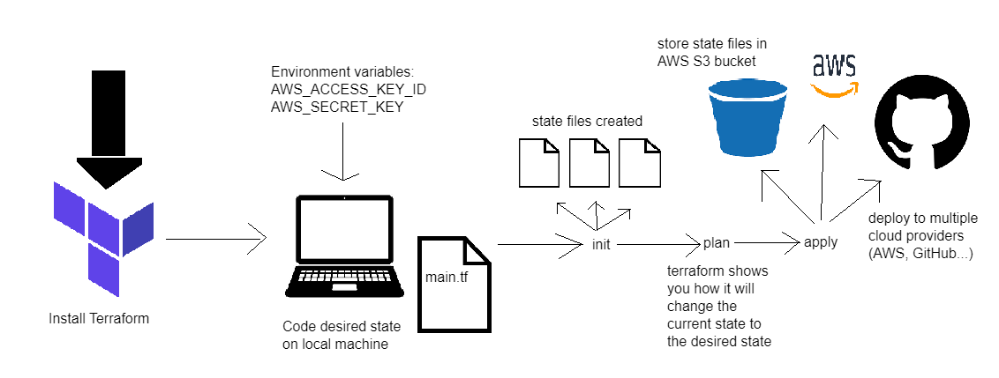
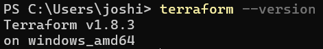
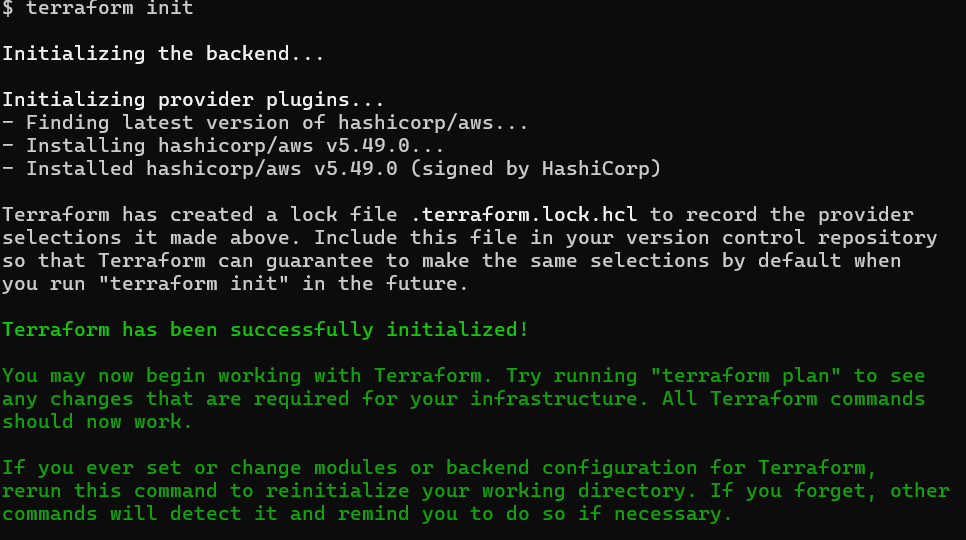
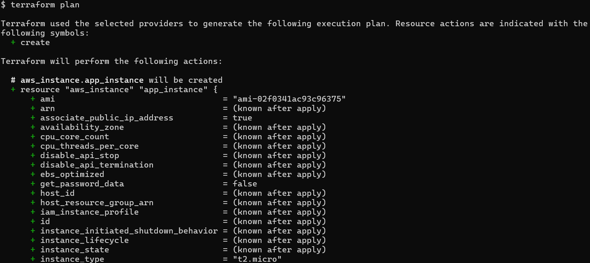
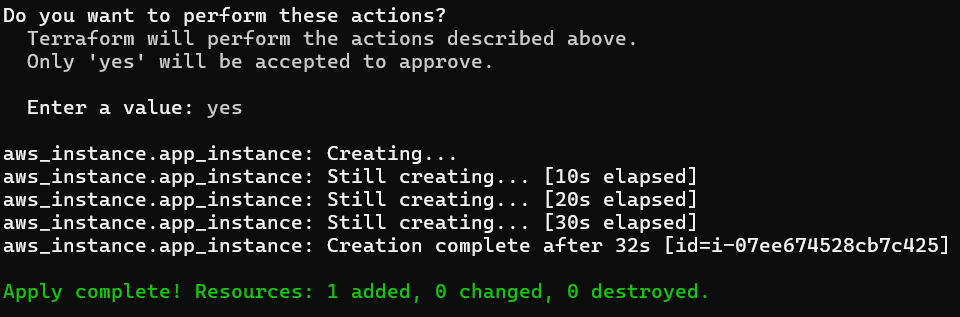
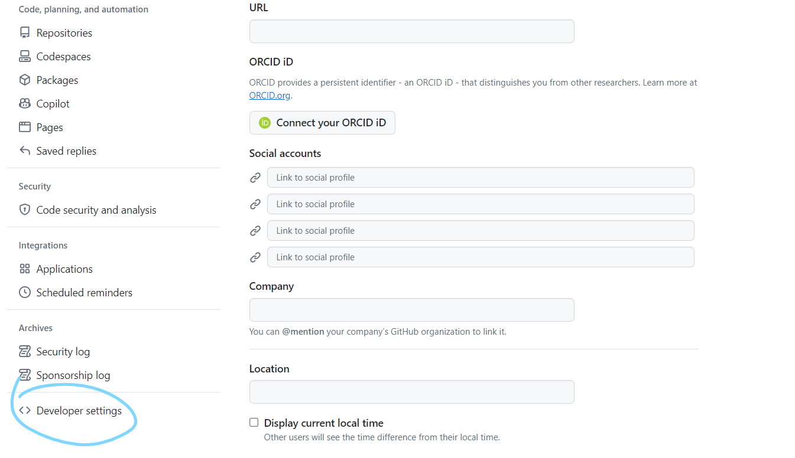
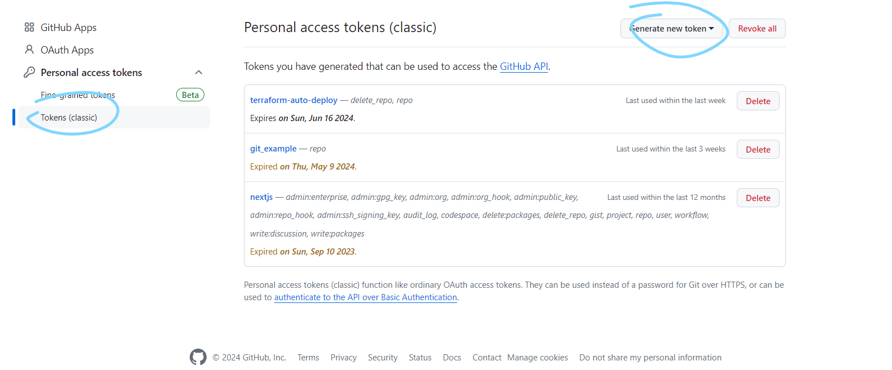
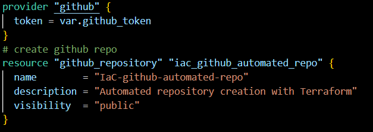

# Terraform

Terraform is an IaC software that allows us to automate deploying instances with code. This means rather than having to navigate to AWS -> EC2 then fill in the information, we can instead codify it.

This is incredibly useful if we want to launch multiple instances, as we know that can take a while doing it through the browser interface. 

## Terraform architecture



## Installing Terraform

Download from `https://developer.hashicorp.com/terraform/install?product_intent=terraform`

For windows, we want to select AMD64 (64 bit).

Once downloaded, put it in its own folder, I put it in my `User` directory. 

Now add terraform to PATH:
1. search `env` -> `edit system variables` -> `Environment variables`
2. In your system variables, edit Path, then add a new line to the folder that contains terraform e.g. `C:\Users\joshi\terraform\`
3. Check installation by opening a new cmd and running terraform --version



## Using Terraform to load a new EC2 instance with code

We will create a terraform file that after running will load up our app instance

1.  We need to link to terraform our AWS credentials, so that it can run a new instance under our account. We will do this by providing our access key and secret key.
    - However, we DO NOT want to hardcode these into our terraform file as that is a security risk.
    - Instead, we will add these as environment variables with the correct name so that terraform knows where to look for them
    - Similarily to installing terraform, navigate to environment variables. Add two user variables: `AWS_ACCESS_KEY_ID` and `AWS_SECRET_KEY` and put in their corresponding values
2. Now open Git Bash in administrator
3. Since terraform was added to our path, we can run terraform anywhere. Create a directory for your terraform files and in that create a `main.tf` (in the folder run `nano main.tf`)
4. We can start writing the terraform script

### Script to load basic instance

Comments start with `#`

The syntax uses named code blocks, then HCL (so key = value pairs. The values are surrounded by "")

Start the script with the cloud provider for the instance, and the region in the cloud provider:

```tf
provider "aws"{

        region = "eu-west-1"
}
```

After doing this, run `terraform init`. You should see this:



Now provide the information for the kind of service you want from the cloud provider, and how that service will be implemented:

```tf
# which service (ec2 instance)
resource "aws_instance" "app_instance"{
# which ami
        ami = "frenkvlw"
# which controller (micro)
        instance_type = "t2.micro"
# associate public ip
        associate_public_ip_address = true
# name
        tags = {
                Name = "tech258-joshual-terraform-app"
        }
}
```

:boom: :warning: **IMPORTANT** :boom: :warning:  

- NEVER hardcode your credentials in this file. ALWAYS set your credentials as environment variables
- DO NOT PUSH the folder containing the terraform script to GitHub until you make the correct `.gitignore` file. This is because additional files are created that store the access credentials as backup, and so they would be exposed if pushed.

### The gitignore

The files to remember to include in the .gitignore:
```
.terraform/
.terraform.lock.hcl
terraform.tfstate
terraform.tfstate.backup
```

There are some others we should include like `variable.tf` too.

Now we can run `terraform plan`. This is similar to right before launching an instance where we can see a summary of what will be made:



If all looks good, run `terraform apply` then type `yes`. This effectively launches the instance



Afterwards if we go to our instances on AWS, we should see an instance loading with the name given.

To terminate the instance, run `terraform destroy`.

For more commands, run `terraform`.

### VPC, subnets and security groups for the instances

Our app instance was only deployed with the default security group (so only SSH allowed). We would also like to allow 80 and 3000, as well as deploy a DB instance that allows 22 and 27017. We do this by creating a VPC (in our case, the IP is 10.0.0.0/16) and then we can create a security group and assign it to the VPC.

It is also a good idea to create subnets - a public and private subnet - for the app and db instances so that we can configure routing for the private subnet in the future. For now they are identical.

To create a VPC referred to as main in the code (called joshual-vpc in the AWS console):
```tf
resource "aws_vpc" "main" {
  cidr_block = "10.0.0.0/16"

  tags = {
    Name = "joshual-vpc"
  }

}
```

Now we can create subnets to divide the VPC:

```tf
resource "aws_subnet" "app_subnet" {
  # can use this to refer to the vpc above (since we named it "main") 
  vpc_id     = aws_vpc.main.id
  cidr_block = "10.0.6.0/24"

  tags = {
    Name = "joshual-app-subnet"
  }
}

resource "aws_subnet" "db_subnet" {
  vpc_id     = aws_vpc.main.id
  cidr_block = "10.0.16.0/24"

  tags = {
    Name = "joshual-db-subnet"
  }
}
```

Now we can create the security groups. In the definition of the group, we can add the rules (ingress for inbound, egress for outbound). Remember we refer to the VPC to assign security groups.
```tf
# create security group
resource "aws_security_group" "app_sg" {
  name        = "joshual_app_sg__allow_ssh_http_3000"
  description = "Allow TLS inbound traffic and all outbound traffic"
  vpc_id      = aws_vpc.main.id

  # this is how you can add a rule to the security group. ingress for inbound, egress for outbound
  ingress {
    description = "Allow SSH"
    from_port   = 22
    to_port     = 22
    protocol    = "tcp"
    cidr_blocks = ["0.0.0.0/0"]
  }

  ingress {
    description = "Allow HTTP"
    from_port   = 80
    to_port     = 80
    protocol    = "tcp"
    cidr_blocks = ["0.0.0.0/0"]
  }

  ingress {
    description = "Allow 3000 for Node"
    from_port   = 3000
    to_port     = 3000
    protocol    = "tcp"
    cidr_blocks = ["0.0.0.0/0"]
  }

  egress {
    from_port   = 0
    to_port     = 0
    protocol    = "-1"
    cidr_blocks = ["0.0.0.0/0"]
  }

  tags = {
    Name = "joshual_app_sg__allow_ssh_http_3000"
  }

}
```
Finally in our instance definition we add the subnet and the security groups so it uses those:

```tf
resource "aws_instance" "app_instance"{
  ...
  subnet_id = aws_subnet.app_subnet.id
  # give the security group
  vpc_security_group_ids = [aws_security_group.app_sg.id]
  ...
}
```

## Variables

We can use variables in Terraform similarily to Python.

Lets say we want to push our code to GitHub, including our `main.tf` file. In that file, in the instance definition, we had potentially sensitive information, such as the instance type, AMI used and so on. To fix this, we can use variables. We save our variables in another file called `variable.tf`. In that, we can define variables e.g.:

```tf
variable "app_ami_id" {

    default = "ami-enfwef"
}
```

Now in `main.tf` we can refer to the variable directly like `ami = var.app_ami_id`.

We still have to make sure people do not have access to the `variable.tf` file, so include it in the `.gitignore` along with the other files.

## Desired State vs Current State

All the work we have done so far has been on our `main.tf` file, a configuration file where we code how we want terraform to build our architecture. This is the desired state.

When we run `terraform init` a few state files are made, including `terraform.tfstate`. This is a state file that hasn't been configured yet. When we code our desired state and run `terraform plan`, terraform reads the configuration files, as well as the current state from the state file. It then compares the desired state with the current state and then shows you how it will bring the current state up to the desired state. Finally running `terraform apply` actually applies the changes and brings the current state to the desired state. The state file is then updated to be the desired state.

We can run commands like `terraform state list`, `terraform state show`, `terraform state mv` and `terraform state rm` to manually change the state if needed.


## Terraform Multi-Cloud deployment

As shown in the diagram, we can, in a singular terraform file, deploy multiple layers of infrastructure over mutliple cloud providers. For example, we could deploy our instances on AWS as well as deploy a GitHub repository at the same time. And when we `terraform destroy`, all infrastructure created is deleted.

### Deploying a GitHub repository with Terraform

1. Generate a Personal Access Token (PAT) on GitHub:
   1. Goto Setting on your GitHub account -> Developer Settings -> Tokens -> Generate new Token
  
  
  2. Give it the repo scope as well as the ability to delete repos (so it can deploy and destroy the repository generated)
  3. Click generate and save the token for later (you will not be able to see it again)
2. Now in your `main.tf` file:
   1. With the `github` provider, create a new resource for a repository with the name of your choosing
   
   2. Make sure to use a variable to store the token so that it is not explicitly written in the `main.tf` file. You do not want anyone to have access to your PAT.
3. Now when running `terraform apply` a GitHub repo is additionally created under your account. 
